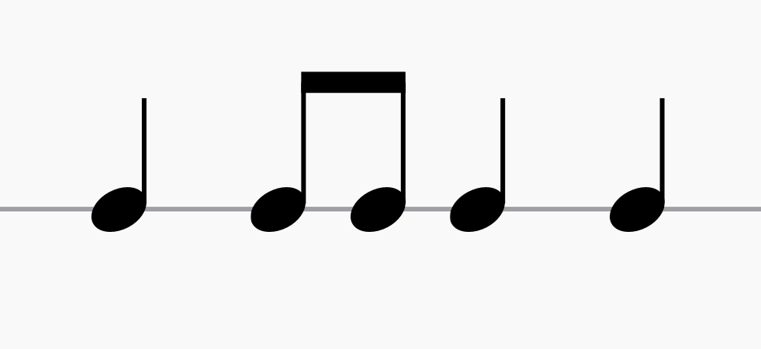

---
tags:
---

# Binalig

**_Binalig_** is a term meaning "made different" in the [[maguindanao|Maguindanaon]] language.

- it is the embodiment of change in [[kulintang]] music

## Rhythm

Binalig is a common rhythmic mode in [[kulintang]] music.

In a [[palabunibunyan|kulintang ensemble]], each player follows this basic pattern and improvises rhythms and phrases over it.

## Sources

- [Kulintang Listening Session by Harold Andre (YouTube)](https://www.youtube.com/watch?v=7b7iDVjvxPs)
- [Binalig (Maguindanaon) by Pantayo (Bandcamp)](https://pantayo.bandcamp.com/track/binalig-maguindanaon)
