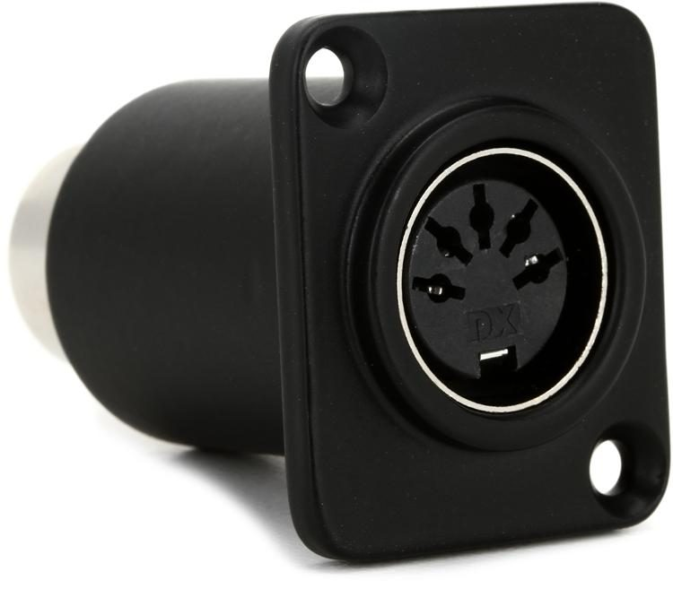

---
tags:
---

# DIN Connector

The **DIN connector** is an electrical connector standardized in the early 1970s by the Deutsches Institut für Normung (DIN), the German national standards organization.

## MIDI

The original hardware specification for the [[MIDI]] protocol was the **5-pin DIN connector**.

Typical MIDI connections are male on both ends, though there are female-female connectors that allow for daisy changing.

MIDI hardware tends to be equipped with 5-pin MIDI ports (female jacks).

The `THRU` port on MIDI hardware immediately relays all data received at IN port facilitating device "daisy-changing" for simultaneous use.

Connector pin numbering:

- on female connector, left to right:
  - 3, 5, 2, 4, 1
- on male connector, left to right:
  - 1, 4, 2, 5, 3
- data transmitted on pin 4, received on pin 5 (at 5V DC)
- pin 2 shield/ground
- pins 1 and 3 are _unused_
  - they serve to distinguish from XLR?
- MIDI-XLR adapters are possible
- uniqueness of 5-pin design meant to prevent erroneous connections

## Sources

- <https://en.wikipedia.org/wiki/DIN_connector>
- MUS 407 MIDI
