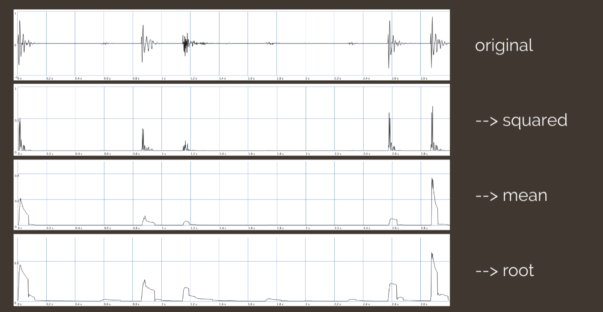
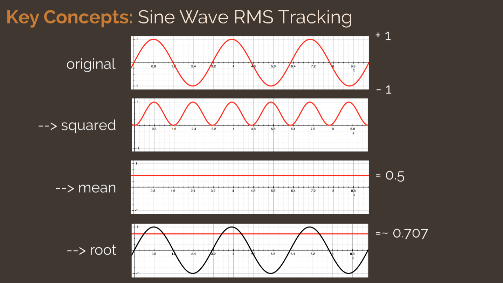

# Dynamic Range Processing

**Dynamic Range**: Difference between highest/lowest level (dB) of an audio signal

A _dynamic range process_ (DRP) changes a signal's dynamic range by altering its amplitude.

- measuring signal amplitude
- adjusts signal amplitude based on measured value

Measured & processed signals can be the same or different

Applications include:

- maintaining a constant signal level
- increasing the overall level of a mix
- creative transient shaping
- noise reduction
- preventing clipping/overloading
- side-chaining (amplitude following, ducking)

## Key Concepts

All forms of DRP rely on an amplitude **threshold**.

- determines signal level above or below which DRP take effect, depending on the type of effect

DRPs utilize a **detection circuit**or **detection algorithm** for tracking signal amplitude, which can track either _peak_ or _average_ signal level

**Peak**: instantaneous measurement, captures true waveform peaks

**Average**: signal values averaged over a time interval, also called _RMS_ (root-mean-squared) tracking

Peak tracking is more applicable for preventing overloading/clipping.

RMS tracking provides a smoother response to a changing input signal.

### Why RMS?

What happens if we average sinusoidal values over a period of time?

- Positive and negative values will cancel, resulting in a zero average

RMS means we take the square _root_ of the _mean_ of a sequence of _squared_ sample values:

$x_{RMS}=\sqrt{\frac{x^2_1+x^2_2+x^2_3+...+x^2_n}{n}}$

This always produces non-negative values, provides more meaningful measurement, and more accurately reflects continuous signal power.

### RMS Tracking

### Peak Tracking

## Types

- Noise gate ([[noise-gate]])
- Compressor ([[compression]])
- [[Limiter]]

## More Terms & Techniques

## Transfer Function Examples
