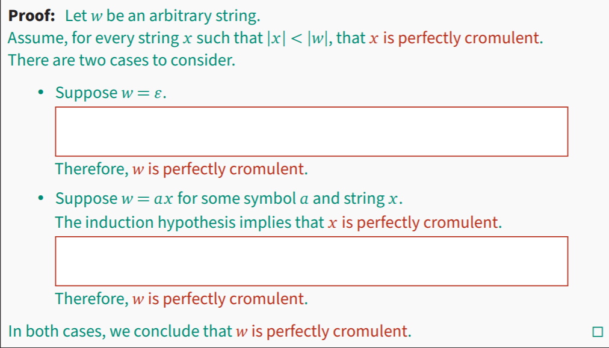

# Induction on Strings

Induction is _the_ standard technique for proving statements about recursively defined objects. Erickson's recommended variant of induction has two primary design considerations:

1. **The case structure of the proof should mirror the case structure of the recursive definition**. Ex: a proof about all [[string]]s should have two cases: either $w = \epsilon$ or $w = ax$ for some symbol $a$ and some string $x$; other proofs may require finer subcases
2. **The inductive hypothesis should be as strong as possible**

## Boilerplate

String-induction proofs have the following boilerplate structure, with an arbitrary definition of being "perfectly cromulent":

## Sources

- [Algorithms: Strings by Jeff Erickson](https://courses.engr.illinois.edu/cs374/fa2021/A/notes/models/01-strings.pdf)
