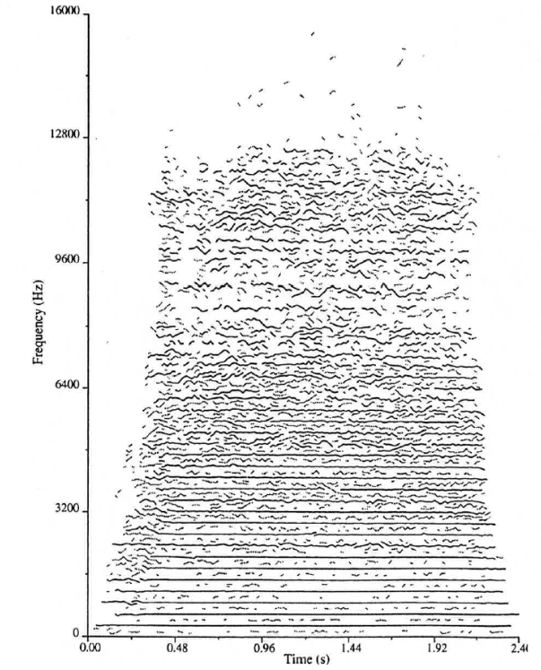

# McAulay-Quatieri Algorithm

The **McAulay-Quatieri (MQ)** algorithm is an [[algorithm]] that converts a [[sound-waves|sound]] into a collection of sinusoidal components ([[sine-wave|sine waves]]), each with their own [[amplitude]] and [[frequency]] [[envelope]].

- a method of [[frequency-decomposition|frequency decomposition]] used in [[long-window-time-varying-spectral-analysis|long window spectral analysis]]
- each sine wave component is called a "track"
- each track is computed using a [[fast-fourier-transform|FFT]] or [[short-time-fourier-transform|STFT]]

Compared to other [[spectral-analysis|spectral analysis]] techniques:

- uniquely capable of analyzing sounds without a stable [[harmonic-series|harmonic structure]], i.e. polyphonic or inharmonic sounds, instrument tones with large vibrato
- provides information to control a real-time [[additive-synthesis|additive synthesis]] engine
- by default, generates an arbitrary number of sinusoidal tracks

## Common Analysis Procedure

1. Select Kaiser Window parameters: **length** ($N$) and **shape** ($\alpha$)
   - $N$ is usually 50-300 ms
   - select **hop size** (usually ~3 ms)
   - Modification: _express Kaiser Window equations in terms of more musically useful parameters_
     - Main Lobe Width: minimum frequency separation between partials
     - Side Lobe Attenuation: usually around -90 dB
   - Different sounds have different trade-offs between these parameters
2. Window and FFT the signal. Keep only peaks in spectrum: for each peak, store the bin frequency, magnitude, and phase.
   - Modification: _improve frequency estimate of each peak_
     - draw vertical parabola through peak magnitude and its left and right neighbor
     - improved frequency estimate is at the top of parabola
3. Create [[partial]] frequency envelopes by stringing together peaks from consecutive FFTs
   - Handle birth of new partials and death of old partials (involves many threshold and hysteresis parameters)
   - Avoid crossing partials, "doodley-doo" artifacts, etc.
4. Perform additive sine wave synthesis
   - [[amplitude]] envelope: use linear interpolation between magnitude values
   - phase: use quadratic phase interpolation by matching phase and bin frequency at each peak
   - frequency envelope: determined by phase computation
   - Modification: _better frequency synthesis approach_
     - obtain frequency envelope through linear interpolation of improved frequency estimates from modified step 2
     - obtain phase information through frequency computation. The synthesized phase will _not_ match the analyzed phase (same kind of synthesis for [[short-window-time-varying-spectral-analysis|short window analysis]])

## Sources

- <https://citeseerx.ist.psu.edu/viewdoc/download?doi=10.1.1.21.8075&rep=rep1&type=pdf>
