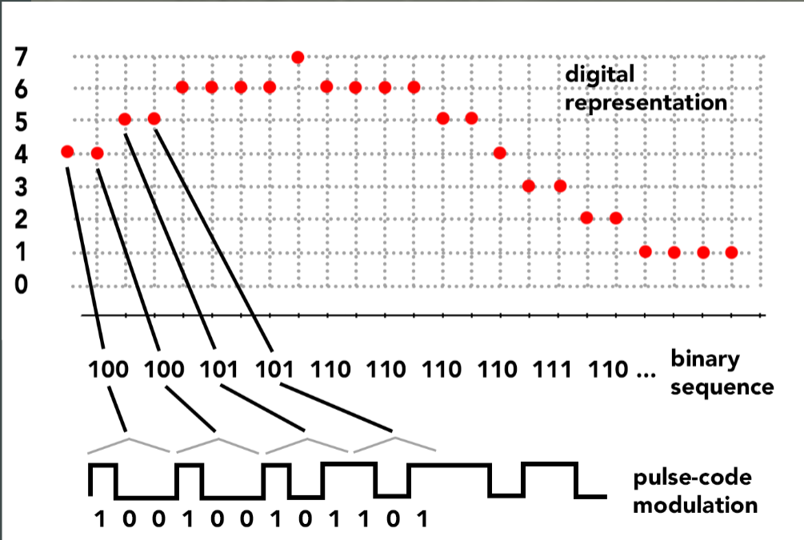
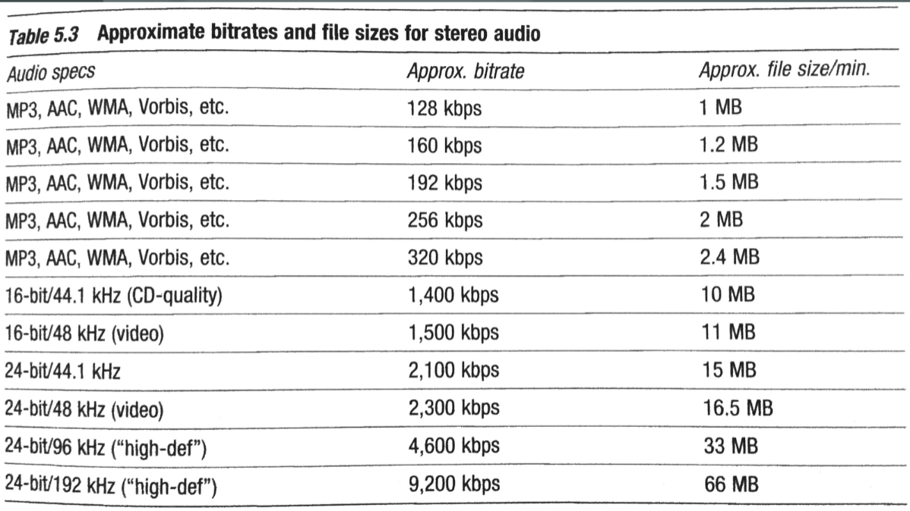

# Sampling (Signal Processing)

Sampling involves taking periodic measurements of an analog signal and assigning a digital value to each measurement.

- [Sampling (Signal Processing)](#sampling-signal-processing)
  - [Sample Rate](#sample-rate)
  - [Bit Depth](#bit-depth)
  - [The Nyquist Frequency](#the-nyquist-frequency)
  - [Aliasing](#aliasing)
    - [Quantization Error and Dynamic Range](#quantization-error-and-dynamic-range)
    - [Dither](#dither)
  - [Digital Audio Standards](#digital-audio-standards)
  - [File Formats](#file-formats)
    - [Uncompressed File Formats](#uncompressed-file-formats)
      - [Uncompressed File Size](#uncompressed-file-size)
    - [Compressed File Formats](#compressed-file-formats)
      - [Lossy Compression](#lossy-compression)
      - [Lossy Compression File Size](#lossy-compression-file-size)

## Sample Rate

Sampling occurs at one of several standardized sampling rates:

| Sample Rate (samples/second) | Description                                                                              |
| ---------------------------- | ---------------------------------------------------------------------------------------- |
| `32000`                      | only used in radio and transmission applications                                         |
| `441001`                     | 44.1 standard for CD-quality audio                                                       |
| `48000`                      | 44.1 and 48 common for many applications                                                 |
| `88200`                      | adopted by many professional studios and industries                                      |
| `96000`                      | adopted by many professional studios and industries                                      |
| `176400`                     | adopted by many professional studios and industries                                      |
| `192000`                     | adopted by many professional studios and industries, 4x the standard `48000` sample rate |

Sampling is an inherently **discrete** process.

- No knowledge of what happens in-between samples; this data is necessarily lost

## Bit Depth

Bit depth determines the number of bits used to represent each sample

- i.e. the number of available resolution points to which a measured analog value can be approximated
- 1 byte = 8 bits

Also referred to as _sample width_

Number of resolution points = $2^{\text{bit depth}}$

- `1`-bit system; 2 resolution points
- `2`-bit system; 4 resolution points
- `8`-bit system; 256 resolution points
- `16`-bit system; 65536 resolution points (1 byte per sample)
- `32`-bit system; a lot of resolution points (4 bytes per sample)

Consider the analog-to-digital conversion process in a 3-bit system:



The amplitude of each sample is quantized to a particular bit and encoded into binary. We then encode the binary into a modulated pulse wave.

## The Nyquist Frequency

See: [[nyquist-frequency]]

## Aliasing

See: [[aliasing]]

### Quantization Error and Dynamic Range

The discrepancy between an analog signal's true value and its quantized approximation is called **quantization error.**

- the amount of rounding we had to do to fit the samples into our digital recording system
- quantization error is heard as noise in the digital signal
  - quantization is effectively adding a small random value to the original value of a sample - over many samples, this comes off as noise
  - noise itself is just random values in the digital realm

greater bit depth --> higher sample resolution --> smaller quantization error --> better signal-to-noise ratio

Bit depth determines the maximum _dynamic range_ of a digital audio signal.

- `16`-bits gives us 96 dB to work
- `24`-bits gives us 120-something dB
- Our pain threshold goes up to 120-something dB, so we don't need to raise the bit depth past something like `16`-bits.

`dynamic range (dB) ~= 6 x bit depth`, e.g. an 8-bit system provides 48 dB of dynamic range

- signals at or below -48 dBFS will be unresolvable from the noise floor

Reducing the bit depth, and therefore dynamic range, does _not_ reduce the number of samples taken (the sample rate). We can still represent high frequency content, but reducing the bit depth reduces the dynamic range at which we can represent the audio content.

### Dither

Periodic signals exhibit a regular, predictable pattern of quantization error.

- smooth signals take on a more square-like appearance
- low amplitude signals have access to fewer resolution points, and are therefore particularly prone
- results in additional high-frequency components in the spectrum, also called harmonic distortion

**Dither** is a small amount of low-level noise added to an analog signal, prior to sampling/quantization, in order to randomize (and therefore eliminate) quantization error.

Think: _dithering_ option when exporting audio

- spreads quantization noise more evenly throughout the spectrum
- often used when converting from higher bit depths down to 16-bit

## Digital Audio Standards

The compact disc stores 16-bit audio at 44100 samples per second.

- dynamic range = 96 dB, N = 22050

Many professional studios work with 24- or 32-bit audio at 192000 samples per second

- dynamic range = 144/192 dB, N = 96000

Higher sample rates/bit depths consume significantly more memory. Are the higher specs worth it?

- Debatable, considering that pro-quality audio is often downsampled to 44.1/16 for physical media production/mass distribution
- Consumer listening often occurs in sub-ideal listening environments, with consumer-grade equipment, etc.

## File Formats

Digital audio samples are stored in a standardized file format, which determines what information is stored. Two broad categories:

1. **Uncompressed**: data stored in full resolution
2. **Compressed**: data size is reduced
   1. **Lossless compression**: original uncompressed data is recoverable
   2. **Lossy compression**: Original uncompressed data is permanently lost

### Uncompressed File Formats

Among the most common formats are:

- **AIFF** (audio interchange file format)
  - Apple, 1988, `.aiff` or `.aif`
- **WAVE** (waveform audio file format)
  - Microsoft/IBM, 1991, `.wav`

Both formats exhibit the following characteristics:

- typically encoded via linear pulse-code modulation (LPCM)
- are full-resolution: every digital sample stored as a `16`, `24`, or `32` bit value
- include header information at beginning of file
  - sample rate, bit depth, number of channels, metadata, etc.

#### Uncompressed File Size

How many MB per minute in an uncompressed audio file?

Known conversions:

- 8 bits = 1 byte
- 1 MB = 1 million bytes
- 60 seconds = 1 minute

Calculation:

```text
sample rate (samples/sec)
* bit depth (bits/sample) = bits/sec
/ 8 (bits/byte) = bytes/sec
* 60 (sec/min)= bytes/min
/ 1000000 = megabytes/min
* number of channels
```

Results:

- 1 min of stereo 44.1k/16b AIFF/WAV: **approximately 10.5 MB**
- 1 min of stereo 192k/24b AIFF/WAV: **approximately 70 MB**

For comparison, the original 1984 Apple Macintosh could hold approximately 2.3 seconds of stereo 44.1/16 uncompressed audio.


### Compressed File Formats

In _lossless_ compressed audio, file size is reduced, but data can be restored.

- e.g. repeated sample values stored as a single value and number of repeats
- `.wma` (Windows media audio, lossless)
- `.flac` (free lossless audio codec)

Some lossless formats are capable of storing audio in lossy format, e.g. original WMA format. Likewise, some uncompressed formats also support compressed audio, stored in header data.

In _lossy_ compressed audio, file size is reduced, and original data is permanently lost.

- `.mp3` (MPEG-1 and MPEG-2, audio layer III)
- `.AAC` (advanced audio coding)

#### Lossy Compression

Lossy compression relies on _perceptual encoding_, where the nuance of human perception determines which data is removed.

_Masking_ is a phenomenon in which one sound conceals or obscures another

- e.g. electric guitar momentarily drowned out by crash cymbal
- conversation obscured by running water

Perpetual encoding algorithms identify masked regions and assign fewer bits to these samples.

#### Lossy Compression File Size

Lossy compression involves choosing a bitrate (kbits/sec).

- e.g. 128, 256, 320 kbits/sec (other bitrates possible)
- bitrates can be constant or variable during encoding

How many MB per minute in an uncompressed audio file?

Calculation:

```text
bitrate (kbits/sec)
/ 8 (bits/byte) = kbytes/sec
* 60 (sec/min) = kbytes/min
/ 1000 = megabytes/min
```

1 min 128 kbps mp3: approx. **1 MB** (about 1/11t the size of CD-quality audio)


