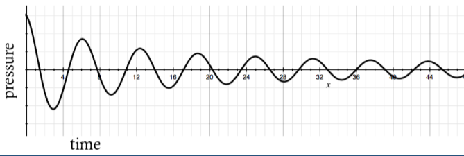

# Time Domain

The **time domain** is a representation of signals or waves (including [[sound-waves|sound waves]]) where axes are labeled as follows:

- x-axis: time
- y-axis: amplitude (pressure, [[loudness]], etc.)

## Sources

- [MUS 407 Sound, Acoustics, & Psychoacoustics](https://prezi.com/view/ZcqvwosFJCFJQtQrbP75/)
