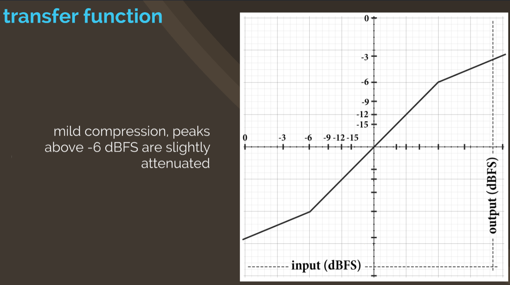
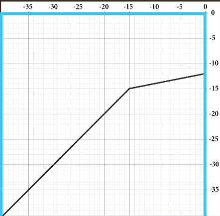

# Transfer Function

A **transfer function** converts a signal input (in [[decibel|dB]]) to an output (in [[decibel|dB]] as well). The shape of the transfer function determines the [[dynamic-range-processing|DRP]] effect.

Example with downward compression:

- Standard amplifier: no [[compression]], linear response
- Mild compression, peaks above -6 dBFS are slightly attenuated
- More severe compression, peaks above -6 dBFS are more strongly attenuated

Most DRP transfer functions only display **one quadrant** to avoid redundancy.

Typically, 0 dB input/output in upper right, axes labeled linearly with respect to dB.

## Ratio

The severity of signal processing is determined by a _ratio_.

- Represents change in input signal (dB) compared to change in output signal (dB)

Example: [[compression]] ratio of 4:1

- above threshold, if input signal increases by 4 dB, output signal is attenuated so that the increase is only 1 dB
- ratios of 8:1 and above are generally considered "extreme" compression
- can result in a perceptual distortion of [[transient]]s, noticeable changes in timbre, often described as a "squashed" sound

## Knee

When signal level crosses a threshold, DRP ratio may be applied fully or gradually, depending on _knee curve_

_Hard/soft_ knee refers to the smoothness of the transfer function graph across the threshold

- a hard knee has two straight lines, above and below threshold
- a soft knee curves gently between affected and unaffected amplitude regions
- differences between hard/soft knee tend to be very subtle, almost indistinguishable
